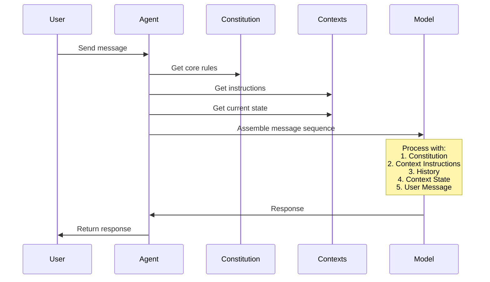

# Message Flow and Context Injection

## Message Order
When an agent processes a message, the components are assembled in the following order:

1. **Constitution** (Top-level system prompt)
   - Fundamental rules and constraints
   - Cannot be overridden by other components
   - Defines core behavioral boundaries

2. **Context Instructions** 
   - Behavioral guidelines from each active context
   - How to use available tools and capabilities
   - Combined from all registered contexts

3. **Message History**
   - Previous conversation messages
   - Maintains conversation continuity

4. **Current Context State**
   - Real-time state information from active contexts
   - Dynamic information about the environment
   - Current state of tools and capabilities

5. **User Message**
   - The actual user input being processed

## Implementation Example
From `agent.py`:
```python
def run_loop(self, user_input: str) -> List[Message]:
    user_message = Message(role="user", content=user_input)

    # 1. Constitution + Context Instructions
    system_message = Message(role="system", content=
                        "\n\n".join([
                            constitution.instruction,  # Core rules
                            *self.get_context_instructions()  # Context guidelines
                        ])
                    )

    # 2. Current Context State
    context_message = Message(role="system", content=
                              f"Current context:\n\n{"\n\n".join(self.get_context())}"
                            )

    # 3. Assemble final message sequence
    response = completion(
        model=self.model,
        messages=[
            system_message,           # Constitution + Context Instructions
            *self.message_log,        # Message History
            context_message,          # Current Context State
            user_message             # User Input
        ],
        tools=self.get_tool_schemas(),
    )
```

## Context Injection Points

Contexts influence the agent's behavior through multiple injection points:

### 1. Instructions Injection
- When: Before processing any message
- Purpose: Provides behavioral guidelines and tool usage instructions
- Method: `get_context_instructions()`
- Example:
```python
def get_context_instructions(self, agent: AgentIdentity) -> Optional[str]:
    return """
    As the assistant you have the ability to create and switch between
    different personas...
    """
```

### 2. State Injection
- When: Before processing user message
- Purpose: Provides current state and environmental information
- Method: `get_context()`
- Example:
```python
def get_context(self, agent: AgentIdentity) -> Optional[str]:
    return f"Current active persona: {self.current_persona.name}"
```

### 3. Tool Injection
- When: During context registration
- Purpose: Provides specialized capabilities
- Method: Tool registration during context initialization
- Example:
```python
def __init__(self) -> None:
    self.tools.append(self.create_persona)
    self.id = uuid.uuid4()
```

## Message Flow Diagram



## Best Practices

1. **Context Independence**
   - Each context should inject independent instructions
   - Avoid assumptions about other contexts' presence

2. **State Management**
   - Keep state information concise and relevant
   - Update state before each message processing

3. **Tool Integration**
   - Register tools during context initialization
   - Tools should be self-contained within their context

4. **Message Order**
   - Don't assume specific message ordering beyond the documented flow
   - Constitution always comes first
   - User message always comes last 