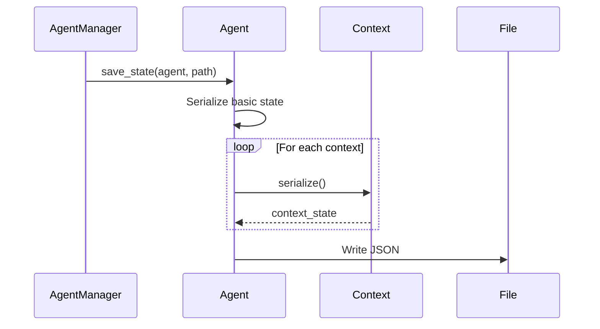
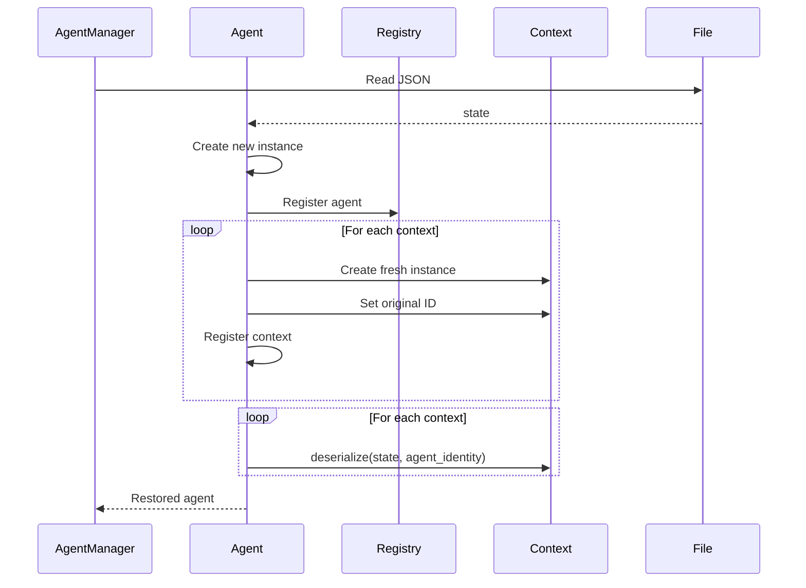

# State Serialization in Swarmer

## Overview

Swarmer uses a JSON-based serialization system to persist agent state between sessions. The system is designed to:
1. Store all essential state in human-readable format
2. Maintain context independence
3. Handle tool recreation properly
4. Preserve agent identity and relationships

## Serialization Flow

### Saving State



1. Agent Manager triggers save
2. Agent serializes its basic state (identity, messages, etc.)
3. Each context serializes its own state
4. Combined state is written to JSON file

### Loading State



1. Read state file
2. Create new agent instance
3. Register agent in registry
4. Create and register fresh contexts
5. Deserialize context states

## Component Responsibilities

### Agent
- Serializes:
  - Identity (name, ID)
  - Token usage
  - Message history
  - Model configuration
  - Context states (delegated)

### Contexts
- Serialize their own state
- Recreate their tools after deserialization
- Maintain their own IDs

### Tools
- Not serialized directly
- Recreated by contexts during deserialization
- Schemas regenerated from function definitions

## Key Design Decisions

1. **Context-First Registration**
   - Contexts are registered before state restoration
   - Ensures tools are available immediately
   - Maintains clean initialization flow

2. **Tool Recreation**
   - Tools are not serialized
   - Recreated from function definitions
   - Avoids function serialization issues

3. **ID Preservation**
   - Context IDs preserved during loading
   - Ensures state matches correct context
   - Maintains relationship consistency

4. **Agent Registry Integration**
   - Agent registered before context deserialization
   - Enables tool creation during state restoration
   - Maintains global agent accessibility

## Example State File

```json
{
  "identity": {
    "name": "User_123",
    "id": "550e8400-e29b-41d4-a716-446655440000"
  },
  "token_budget": 100000,
  "model": "gpt-4",
  "token_usage": {
    "prompt_tokens": 150,
    "completion_tokens": 50,
    "total_tokens": 200
  },
  "message_log": [...],
  "contexts": {
    "PersonaContext": {
      "id": "context-uuid",
      "agent_persona": {...},
      "persona_collection": {...}
    },
    "MemoryContext": {
      "id": "context-uuid",
      "agent_memories": {...}
    }
  }
}
```

## Serialization Order

1. **Save**
   1. Agent basic state
   2. Context states
   3. Write to file

2. **Load**
   1. Create new agent
   2. Register in registry
   3. Create fresh contexts
   4. Register contexts with agent
   5. Deserialize context states

## Assumptions

1. Context classes available at load time
2. Tool functions remain consistent
3. Context IDs are unique
4. Agent registry is available
5. File system is accessible

## Best Practices

1. **Context Independence**
   ```python
   def serialize(self) -> dict:
       """Each context handles its own serialization"""
       return {
           "id": self.id,
           "state": self.state
       }
   ```

2. **Tool Recreation**
   ```python
   def deserialize(self, state: dict, agent_identity: AgentIdentity) -> None:
       """Recreate tools after loading state"""
       self.state = state["state"]
       self.recreate_tools(agent_identity)
   ```

3. **State Validation**
   ```python
   def deserialize(self, state: dict, agent_identity: AgentIdentity) -> None:
       """Validate state before using"""
       if "required_field" not in state:
           raise ValueError("Invalid state")
   ``` 